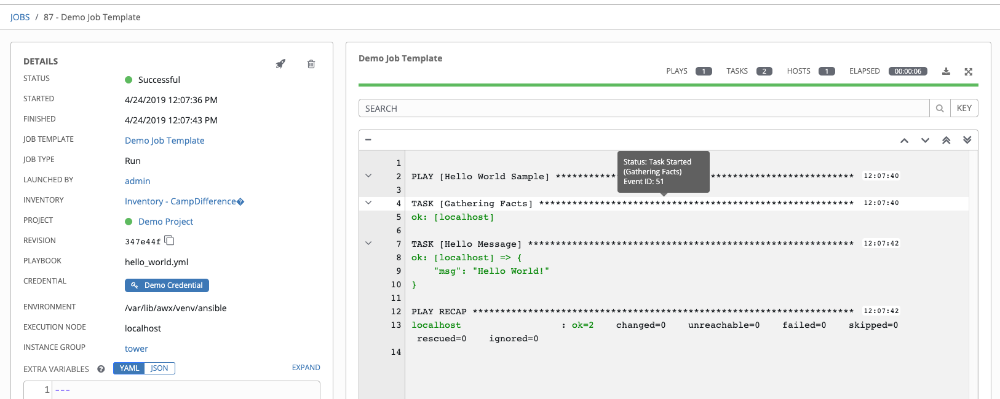

## Overview

<!-- Sensu Integration description; supports markdown -->

The Ansible Tower integration is a [Sensu Event Pipeline][pipeline] that enables Ansible Tower as an automated remediation provider for Sensu Go. This integration enables users to configure "remediation actions" that trigger [Ansible Tower Job Templates][ansible-tower-job-templates].

<!-- Provide a high level overview of the integration contents (e.g. checks, filters, mutators, handlers, assets, etc) -->

This integration includes the following resources:

* `ansible-tower` ([pipeline])
* `ansible-tower` ([handler])
* `ansible_tower_host` ([secret])
* `ansible_tower_token` ([secret])
* `sensu/sensu-ansible-handler:2.1.0` ([asset])

## Dashboards

<!-- List of supported dashboards w/ screenshots (supports png, jpeg, and gif images; relative paths only; e.g. `` )-->

This integration is compatible with the [Ansible Tower Jobs dashboard][ansible-tower-jobs-dashboard]. The Ansible Tower dashboard will display Ansible Tower job status, started/finished times, job template details, and job output.



## Setup

<!-- Sensu Integration setup instructions, including Sensu agent configuration and external component configuration -->
<!-- EXAMPLE: what configuration (if any) is required in a third-party service to enable monitoring? -->

1. Get a Secret Application Token

   [Create an application using the Ansible Tower admin console][ansible-tower-application].

   [Create an application OAuth token using the Ansble Tower admin console][ansible-tower-app-token].

1. Configure Secrets Management

   This integration requires the following [Sensu Secrets][secrets]:

   - `ansible_tower_host` (hostname or IP address of the Ansible Tower API)
   - `ansible_tower_token` (Ansible Tower application OAuth token)

   _NOTE: this integration creates one or more Sensu Secrets using the "env" provider. The corresponding environment variables need to be set on every sensu-backend in the Sensu deployment. To add the environment variables, please modify `/etc/default/sensu-backend` or `/etc/sysconfig/sensu-backend` and restart the sensu-backend service(s)._

1. Add a `io.sensu.ansible.config.actions` ("remediation action") [annotation] to one or more checks.

   **Example**:

   ```yaml
   metadata:
     name: check_nginx
     labels: {}
     annotations:
       io.sensu.ansible.config.actions: |
         [
           {
             "template_name": "Start NGINX",
             "inventory_id": 2,
             "limit": "",
             "occurrences": [ 3 ],
             "severities": [ 1, 2 ]
           },
           {
             "template_id": 8,
             "inventory_name": "Web Servers",
             "limit": "",
             "occurrences": [ 10 ],
             "severities": [ 1, 2 ]
           }
         ]
   ```

## Plugins

<!-- Links to any Sensu Integration dependencies (i.e. Sensu Plugins) -->

- [sensu/sensu-ansible-handler][sensu-ansible-handler-bonsai] ([GitHub][sensu-ansible-handler-github])

## Metrics & Events

<!-- List of all metrics or events collected by this integration. -->

This integration does not produce any [metrics].

## Alerts

<!-- List of all alerts generated by this integration. -->

This integration does not produce any events that should be processed by an alert or incident management [pipeline].

## Reference Documentation

<!-- Please provide links to any relevant reference documentation to help users learn more and/or troubleshoot this integration; specifically including any third-party software documentation. -->

1. [Ansible Tower API (reference documentation)][ansible-tower-api-reference].
1. [Ansible Tower Job Templates (reference documentation)][ansible-tower-job-templates].
1. [Ansible Tower Token-Based Authentication (guide)][ansible-tower-auth-guide].
1. This integration uses [Handler Templating][handler-templating] for variable substitution.

<!-- Links -->
[check]: https://docs.sensu.io/sensu-go/latest/observability-pipeline/observe-schedule/checks/
[asset]: https://docs.sensu.io/sensu-go/latest/plugins/assets/
[subscription]: https://docs.sensu.io/sensu-go/latest/observability-pipeline/observe-schedule/subscriptions/
[subscriptions]: https://docs.sensu.io/sensu-go/latest/observability-pipeline/observe-schedule/subscriptions/
[agents]: https://docs.sensu.io/sensu-go/latest/observability-pipeline/observe-schedule/agent/
[annotation]: https://docs.sensu.io/sensu-go/latest/observability-pipeline/observe-schedule/agent/#general-configuration-flags
[plugins]: https://docs.sensu.io/sensu-go/latest/plugins/
[metrics]: https://docs.sensu.io/sensu-go/latest/observability-pipeline/observe-schedule/metrics/
[pipeline]: https://docs.sensu.io/sensu-go/latest/observability-pipeline/observe-process/pipelines/
[handler]: https://docs.sensu.io/sensu-go/latest/observability-pipeline/observe-process/handlers/
[secret]: https://docs.sensu.io/sensu-go/latest/operations/manage-secrets/secrets/
[secrets]: https://docs.sensu.io/sensu-go/latest/operations/manage-secrets/secrets/
[tokens]: https://docs.sensu.io/sensu-go/latest/observability-pipeline/observe-schedule/tokens/
[handler-templating]: https://docs.sensu.io/sensu-go/latest/observability-pipeline/observe-process/handler-templates/
[sensu-plus]: https://sensu.io/features/analytics
[sensu-ansible-handler-bonsai]: https://bonsai.sensu.io/assets/sensu/sensu-ansible-handler
[sensu-ansible-handler-github]: https://github.com/sensu/sensu-ansible-handler
[ansible-tower-job-templates]: https://docs.ansible.com/ansible-tower/latest/html/userguide/job_templates.html
[ansible-tower-jobs-dashboard]: https://docs.ansible.com/ansible-tower/latest/html/userguide/jobs.html
[ansible-tower-application]: https://docs.ansible.com/ansible-tower/latest/html/userguide/applications_auth.html#create-a-new-application
[ansible-tower-app-token]: https://docs.ansible.com/ansible-tower/latest/html/userguide/applications_auth.html#add-tokens
[ansible-tower-api-reference]: https://docs.ansible.com/ansible-tower/latest/html/towerapi/api_ref.html
[ansible-tower-auth-guide]: https://docs.ansible.com/ansible-tower/latest/html/administration/oauth2_token_auth.html
