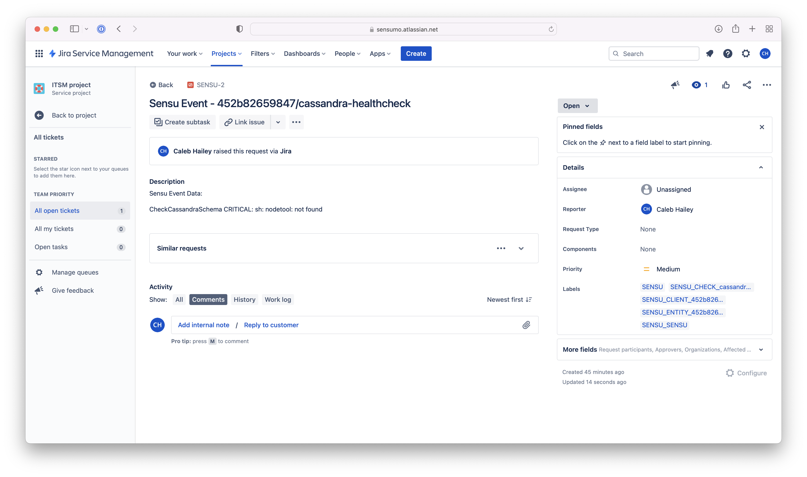

## Overview

<!-- Sensu Integration description; supports markdown -->

The Jira Service Management integration provides a Sensu pipeline that creates Jira incidents based on the events that Sensu checks generate.

<!-- Provide a high level overview of the integration contents (e.g. checks, filters, mutators, handlers, assets, etc) -->

This integration provides the following Sensu resources:

* `jira-servicedesk-handler` [handler]
* `jira-servicedesk-incidents` [pipeline]
* `sensu/sensu-jira-handler:2.0.0` [asset]

## Dashboards

<!-- List of supported dashboards w/ screenshots (supports png, jpeg, and gif images; relative paths only; e.g. `` )-->

The Jira Service Management integration is compatible with the Jira Service Management dashboard. The incident page will display the Sensu event namespace, entity, and check details, including check status.



## Setup

<!-- Sensu Integration setup instructions, including Sensu agent configuration and external component configuration -->
<!-- EXAMPLE: what configuration (if any) is required in a third-party service to enable monitoring? -->

1. Get the Jira Service Management [base URL], project key, [issue type], username, and [API token].

   **Optional**: If you want to use Sensu [secrets] to represent the Jira username and API token, you will need the secret names when you install this integration.

1. Add the `jira-servicedesk-incidents` [pipeline] to one or more [checks].

   <details><summary><strong>Example: Check pipeline configuration</strong></summary>

   ```yaml
   spec:
     pipelines:
       - api_version: core/v2
         type: Pipeline
         name: jira-servicedesk-incidents
   ```

   </details>
   <br>

## Plugins

<!-- Links to any Sensu Integration dependencies (i.e. Sensu Plugins) -->

The Jira Service Management integration uses the following Sensu [plugins]:

- [sensu/sensu-jira-handler:2.0.0][jira-plugin-bonsai]

## Alerts

<!-- List of all alerts generated by this integration. -->

The Jira Service Management integration does not produce any events that should be processed by an alert or incident management [pipeline].

## Metrics

<!-- List of all metrics or events collected by this integration. -->

The Jira Service Management integration does not produce any [metrics].

## Reference Documentation

<!-- Please provide links to any relevant reference documentation to help users learn more and/or troubleshoot this integration. -->

* [Handler templating][handler-templating] (Sensu documentation): the Jira Service Management integration supports handler templating for variable substitution with data from Sensu events
* [Jira Service Management Cloud documentation] (Atlassian documentation)


<!-- Links -->
[check]: https://docs.sensu.io/sensu-go/latest/observability-pipeline/observe-schedule/checks/
[asset]: https://docs.sensu.io/sensu-go/latest/plugins/assets/
[subscription]: https://docs.sensu.io/sensu-go/latest/observability-pipeline/observe-schedule/subscriptions/
[agents]: https://docs.sensu.io/sensu-go/latest/observability-pipeline/observe-schedule/agent/
[annotation]: https://docs.sensu.io/sensu-go/latest/observability-pipeline/observe-schedule/agent/#general-configuration-flags
[plugins]: https://docs.sensu.io/sensu-go/latest/plugins/
[metrics]: https://docs.sensu.io/sensu-go/latest/observability-pipeline/observe-schedule/metrics/
[handler]: https://docs.sensu.io/sensu-go/latest/observability-pipeline/observe-process/handlers/
[tokens]: https://docs.sensu.io/sensu-go/latest/observability-pipeline/observe-schedule/tokens/
[handler-templating]: https://docs.sensu.io/sensu-go/latest/observability-pipeline/observe-process/handler-templates/
[pipeline]: https://docs.sensu.io/sensu-go/latest/observability-pipeline/observe-process/pipelines/
[secrets]: https://docs.sensu.io/sensu-go/latest/operations/manage-secrets/secrets/
[API token]: https://support.atlassian.com/atlassian-account/docs/manage-api-tokens-for-your-atlassian-account/
[jira-plugin-bonsai]: https://bonsai.sensu.io/assets/sensu/sensu-jira-handler
[issue type]: https://confluence.atlassian.com/servicedeskcloud/issue-types-1097176086.html
[base URL]: https://confluence.atlassian.com/adminjiraserver/configuring-the-base-url-938847830.html
[Jira Service Management Cloud documentation]: https://support.atlassian.com/jira-service-management-cloud/resources/
