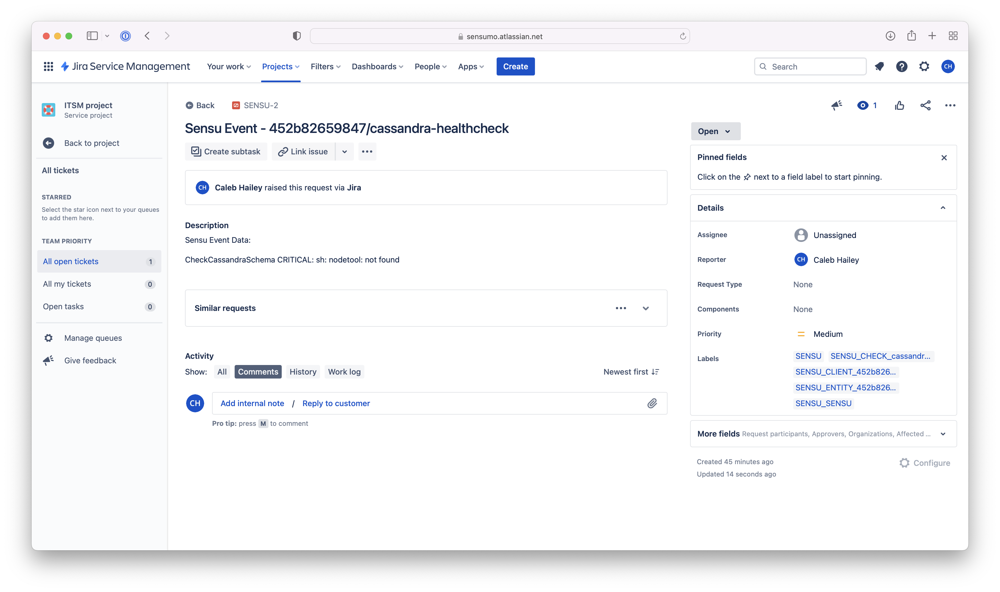

## Overview

<!-- Sensu Integration description; supports markdown -->

The Jira Service Management integration is a Sensu Event Pipeline that generates alerts in the Jira Service Management service.

<!-- Provide a high level overview of the integration contents (e.g. checks, filters, mutators, handlers, assets, etc) -->

This integration provides the following resources:

* `jira-servicedesk-pipeline` [pipeline]
* `jira-servicedesk-handler` [handler]
* `sensu/sensu-jira-handler:2.0.0` [asset]

## Dashboards

<!-- List of supported dashboards w/ screenshots (supports png, jpeg, and gif images; relative paths only; e.g. `` )-->

This integration is compatible with the Jira Service Management dashboard. The Incidents dashboard will display the Sensu Event namespace, entity, and check details (including check status).

## Setup

<!-- Sensu Integration setup instructions, including Sensu agent configuration and external component configuration -->
<!-- EXAMPLE: what configuration (if any) is required in a third-party service to enable monitoring? -->

1. **Get a Jira Service Management API Token**

   While the on-premise version of Jira uses basic HTTP authentication with only
   a simple username and password the [cloud version requires the use of an API
   token to authenticate][about-atlassian-api-tokens].

   To create the API token perform the following steps:

   1. Navigate to [Atlassian's API Tokens Screen][atlassian-api-tokens]
   1. Click on the `Create API Token` button
   1. In the popup box enter `Sensu Jira Handler` or any label of your liking
   1. Click on the `Create` button
   1. Click on `Copy to clipboard` to copy your token

## Plugins

<!-- Links to any Sensu Integration dependencies (i.e. Sensu Plugins) -->

- [sensu/sensu-jira-handler:2.0.0][jira-plugin-bonsai]

## Metrics & Events

<!-- List of all metrics or events collected by this integration. -->

This integration does not produce any [metrics].

## Alerts

<!-- List of all alerts generated by this integration. -->

This integration provides an alert & incident management processing pipeline for use with other monitoring integrations. By default this integration will process all events passing the [built-in `is_incident` filter][is_incident] (i.e. failing events and resolution events only). Event processing via this integration may be suppressed using [Sensu Silencing][silences] (see the [built-in `not_silenced` filter][not_silenced] for more details).

This integration does not produce any events that should be processed by an alert or incident management [handler].

## Reference Documentation

<!-- Please provide links to any relevant reference documentation to help users learn more and/or troubleshoot this integration. -->

1. This integration uses [Handler Templating][handler-templating] for variable substitution
1. This integration uses Sensu's built-in [Secrets Management][secrets-mgmt]

<!-- Links -->
[check]: https://docs.sensu.io/sensu-go/latest/observability-pipeline/observe-schedule/checks/
[asset]: https://docs.sensu.io/sensu-go/latest/plugins/assets/
[subscription]: https://docs.sensu.io/sensu-go/latest/observability-pipeline/observe-schedule/subscriptions/
[agents]: https://docs.sensu.io/sensu-go/latest/observability-pipeline/observe-schedule/agent/
[annotation]: https://docs.sensu.io/sensu-go/latest/observability-pipeline/observe-schedule/agent/#general-configuration-flags
[plugins]: https://docs.sensu.io/sensu-go/latest/plugins/
[metrics]: https://docs.sensu.io/sensu-go/latest/observability-pipeline/observe-schedule/metrics/
[handler]: https://docs.sensu.io/sensu-go/latest/observability-pipeline/observe-process/handlers/
[tokens]: https://docs.sensu.io/sensu-go/latest/observability-pipeline/observe-schedule/tokens/
[handler-templating]: https://docs.sensu.io/sensu-go/latest/observability-pipeline/observe-process/handler-templates/
[pipeline]: https://docs.sensu.io/sensu-go/latest/observability-pipeline/observe-process/pipelines/
[secret]: https://docs.sensu.io/sensu-go/latest/operations/manage-secrets/secrets/
[secrets-mgmt]: https://docs.sensu.io/sensu-go/latest/operations/manage-secrets/secrets-management/
[about-atlassian-api-tokens]: https://support.atlassian.com/atlassian-account/docs/manage-api-tokens-for-your-atlassian-account/
[atlassian-api-tokens]: https://id.atlassian.com/manage/api-tokens
[jira-plugin-bonsai]: https://bonsai.sensu.io/assets/sensu/sensu-jira-handler
[is_incident]: https://docs.sensu.io/sensu-go/latest/observability-pipeline/observe-filter/filters/#built-in-filter-is_incident
[not_silenced]: https://docs.sensu.io/sensu-go/latest/observability-pipeline/observe-filter/filters/#built-in-filter-not_silenced
[silencing]: https://docs.sensu.io/sensu-go/latest/observability-pipeline/observe-process/silencing/
[silences]: https://docs.sensu.io/sensu-go/latest/observability-pipeline/observe-process/silencing/