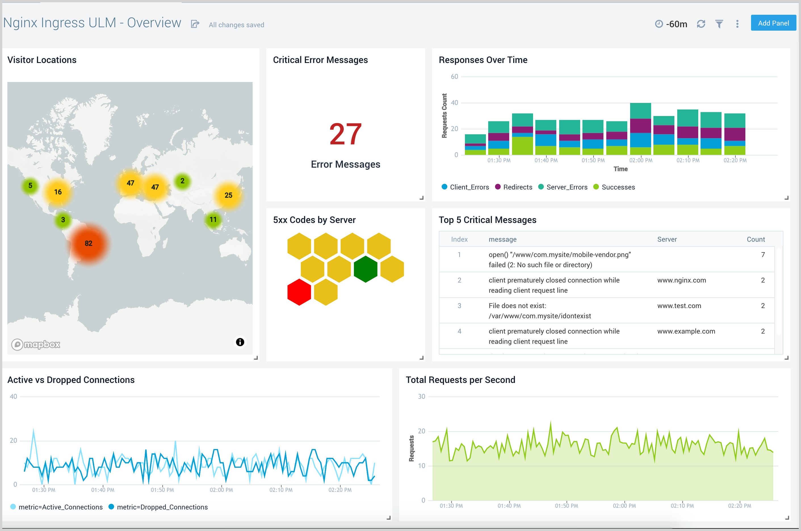

## Overview

<!-- Sensu Integration description; supports markdown -->

The NGINX Monitoring integration uses the [NGINX stub status module][nginx_stub_status] to send alerts and collect NGINX metrics.

<!-- Provide a high level overview of the integration contents (e.g. checks, filters, mutators, handlers, assets, etc) -->

This integration provides the following Sensu resources:

- `nginx-metrics` [check]
- `sensu/nginx-check:0.1.0` [asset]

### Dashboards

<!-- List of supported dashboards w/ screenshots (supports png, jpeg, and gif images; relative paths only; e.g. `` )-->

The NGINX Monitoring integration is compatible with the [Sumo Logic NGINX apps] (included with [Sensu Plus]).



## Setup

<!-- Sensu Integration setup instructions, including Sensu agent configuration and external component configuration -->
<!-- EXAMPLE: what configuration (if any) is required in a third-party service to enable monitoring? -->

1. Enable the [NGINX stub status module][nginx_stub_status] on the NGINX instances you want to monitor.

   <details><summary><strong>Example: NGINX configuration snippet for enabling sub status module</strong></summary>

   ```yaml
   # NGINX status module
   location /nginx_status {
       stub_status;
       allow 0.0.0.0;
   }
   ```

   </details>
   <br>

2. Get the NGINX stub status URL.

1. Decide which Sensu agents should execute the `nginx-metrics` check. You will need the agent [subscription] names when you install this integration.

1. If you want to use a Sensu [pipeline] to process NGINX Monitoring integration data, you will need the pipeline names when you install this integration.

   You can configure separate pipelines for alerts, metrics, and incident management.

1. **Optional** Specify a custom stub_status URL.

   The NGINX Monitoring integration uses the stub_status URL you specify during installation.

   To override the stub_status URL and specify a custom URL on a per-host basis, add the `check_nginx_status_url` [annotation] to the Sensu [agent] configuration file (`agent.yml`).

   <details><summary><strong>Example: Custom stub_status URL configuration</strong></summary>

   ```yaml
   annotations:
     check_nginx_status_url: "CUSTOM_STUB_STATUS_URL"
   ```

   </details>
   <br>


## Plugins

<!-- Links to any Sensu Integration dependencies (i.e. Sensu Plugins) -->

The NGINX Monitoring integration uses the following Sensu [plugins]:

- [sensu/nginx-check:0.1.0][sensu-nginx-check-bonsai] ([GitHub][sensu-nginx-check-github])

## Alerts

<!-- List of all alerts generated by this integration. -->

The NGINX Monitoring integration produces the following events that should be processed by an alert or incident management [pipeline]:

**nginx_active**

Generates a WARNING event if the `nginx_active` value exeeds the user-configured threshold (default 300).

**nginx_waiting**

Generates a WARNING event if the `nginx_waiting` value exeeds the user-configured threshold (default 30).

**nginx_status**

Generates a CRITICAL event if the `nginx_status` endpoint is unreachable.

## Metrics

<!-- List of all metrics or events collected by this integration. -->

The NGINX Monitoring integration collects the following [metrics]:

Metric name | Description
----------- | -----------
`nginx_active` | Current number of active client connections including `Waiting` connections.
`nginx_accepts` | Total number of accepted client connections.
`nginx_handled` | Total number of handled connections. Typically matches the `nginx_accepts` value except when a resource limit is reached (for example, the [worker_connections limit]).
`nginx_requests` | Total number of client requests.
`nginx_reading` | Current number of connections where nginx is reading the request header.
`nginx_writing` | Current number of connections where nginx is writing the response back to the client.
`nginx_waiting` | Current number of idle client connections waiting for a request.

## Reference Documentation

<!-- Please provide links to any relevant reference documentation to help users learn more and/or troubleshoot this integration. -->

* [Token substitution] (Sensu documentation): the NGINX Monitoring integration supports Sensu tokens for variable substitution with data from Sensu entities
* [NGINX `ngx_http_stub_status_module`][nginx_stub_status] (NGINX documentation)


<!-- Links -->
[check]: https://docs.sensu.io/sensu-go/latest/observability-pipeline/observe-schedule/checks/
[asset]: https://docs.sensu.io/sensu-go/latest/plugins/assets/
[subscription]: https://docs.sensu.io/sensu-go/latest/observability-pipeline/observe-schedule/subscriptions/
[agent]: https://docs.sensu.io/sensu-go/latest/observability-pipeline/observe-schedule/agent/
[annotation]: https://docs.sensu.io/sensu-go/latest/observability-pipeline/observe-schedule/agent/#general-configuration-flags
[plugins]: https://docs.sensu.io/sensu-go/latest/plugins/
[metrics]: https://docs.sensu.io/sensu-go/latest/observability-pipeline/observe-schedule/metrics/
[handler]: https://docs.sensu.io/sensu-go/latest/observability-pipeline/observe-process/handlers/
[Token substitution]: https://docs.sensu.io/sensu-go/latest/observability-pipeline/observe-schedule/tokens/
[Sumo Logic NGINX apps]: https://www.sumologic.com/application/nginx/
[Sensu Plus]: https://docs.sensu.io/sensu-go/latest/sensu-plus/
[nginx_stub_status]: https://nginx.org/en/docs/http/ngx_http_stub_status_module.html
[sensu-nginx-check-bonsai]: https://bonsai.sensu.io/assets/sensu/nginx-check
[sensu-nginx-check-github]: https://github.com/sensu/nginx-check
[worker_connections limit]: https://nginx.org/en/docs/ngx_core_module.html#worker_connections
