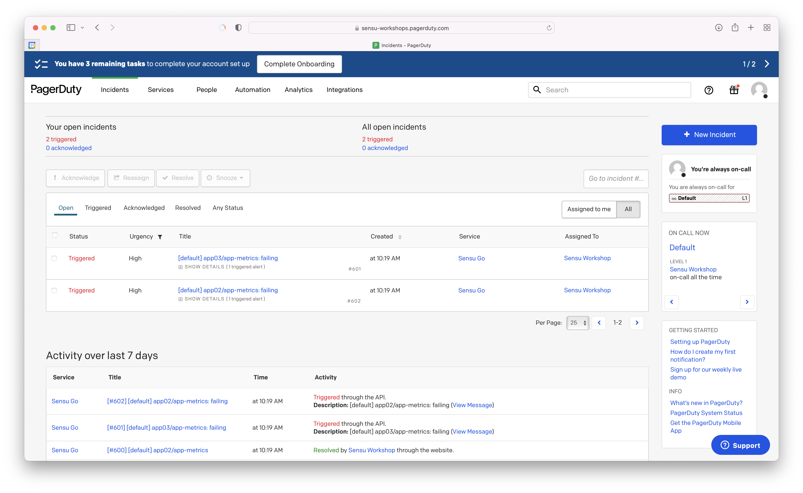
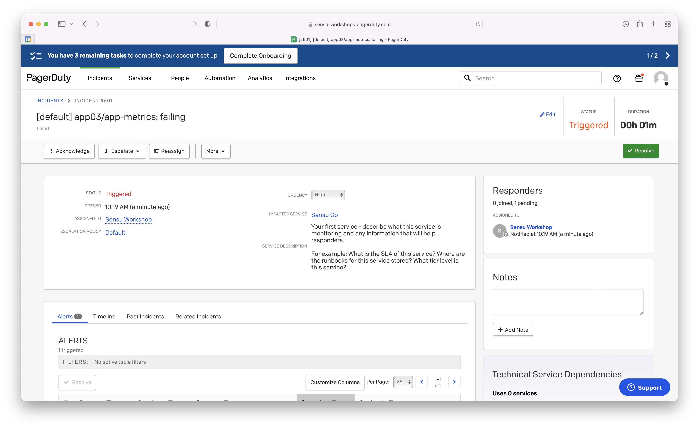

## Overview

<!-- Sensu Integration description; supports markdown -->

The PagerDuty integration provides a Sensu pipeline for sending alerts to the PagerDuty incident response service.

<!-- Provide a high level overview of the integration contents (e.g. checks, filters, mutators, handlers, assets, etc) -->

This integration provides the following Sensu resources:

* `pagerduty` [handler]
* `pagerduty` [pipeline]
* `sensu/sensu-pagerduty-handler:2.1.0` [asset]

## Dashboards

<!-- List of supported dashboards w/ screenshots (supports png, jpeg, and gif images; relative paths only; e.g. `` )-->

The PagerDuty integration is compatible with the PagerDuty [Incidents] dashboard. The Incidents dashboard displays Sensu event namespaces, entities, and check details, including check status and output.




## Setup

<!-- Sensu Integration setup instructions, including Sensu agent configuration and external component configuration -->
<!-- EXAMPLE: what configuration (if any) is required in a third-party service to enable monitoring? -->

1. Get a [PagerDuty integration key][pagerduty-integration-key].

   **Optional**: If you want to use a Sensu [secret] to represent the PagerDuty integration key, you will need the secret name when you install this integration.

1. Add the `pagerduty` [pipeline] to one or more [checks].

   <details><summary><strong>Example: Check pipeline configuration</strong></summary>

   ```yaml
   spec:
     pipelines:
       - api_version: core/v2
         type: Pipeline
         name: pagerduty
   ```

   </details>
   <br>

## Plugins

<!-- Links to any Sensu Integration dependencies (i.e. Sensu Plugins) -->

The PagerDuty integration uses the following Sensu [plugins]:

- [sensu/sensu-pagerduty-handler:2.1.0][pagerduty-plugin-bonsai] ([GitHub][pagerduty-plugin-github])

## Alerts

<!-- List of all alerts generated by this integration. -->

The PagerDuty integration does not produce any events that should be processed by an alert or incident management pipeline.

## Metrics

<!-- List of all metrics or events collected by this integration. -->

The PagerDuty integration does not produce any [metrics].

## Reference Documentation

<!-- Please provide links to any relevant reference documentation to help users learn more and/or troubleshoot this integration. -->

* [Handler templating][handler-templating] (Sensu documentation): the PagerDuty integration supports handler templating for variable substitution with data from Sensu events
* [Services and Integrations] (PagerDuty documentation)


<!-- Links -->
[check]: https://docs.sensu.io/sensu-go/latest/observability-pipeline/observe-schedule/checks/
[asset]: https://docs.sensu.io/sensu-go/latest/plugins/assets/
[subscription]: https://docs.sensu.io/sensu-go/latest/observability-pipeline/observe-schedule/subscriptions/
[agents]: https://docs.sensu.io/sensu-go/latest/observability-pipeline/observe-schedule/agent/
[annotation]: https://docs.sensu.io/sensu-go/latest/observability-pipeline/observe-schedule/agent/#general-configuration-flags
[plugins]: https://docs.sensu.io/sensu-go/latest/plugins/
[metrics]: https://docs.sensu.io/sensu-go/latest/observability-pipeline/observe-schedule/metrics/
[handler]: https://docs.sensu.io/sensu-go/latest/observability-pipeline/observe-process/handlers/
[tokens]: https://docs.sensu.io/sensu-go/latest/observability-pipeline/observe-schedule/tokens/
[handler-templating]: https://docs.sensu.io/sensu-go/latest/observability-pipeline/observe-process/handler-templates/
[pipeline]: https://docs.sensu.io/sensu-go/latest/observability-pipeline/observe-process/pipelines/
[pagerduty-integration-key]: https://support.pagerduty.com/docs/services-and-integrations#generate-a-new-integration-key
[pagerduty-plugin-bonsai]: https://bonsai.sensu.io/assets/sensu/sensu-pagerduty-handler
[pagerduty-plugin-github]: https://github.com/sensu/sensu-pagerduty-handler
[Incidents]: https://support.pagerduty.com/docs/incidents
[Services and Integrations]: https://support.pagerduty.com/docs/services-and-integrations
