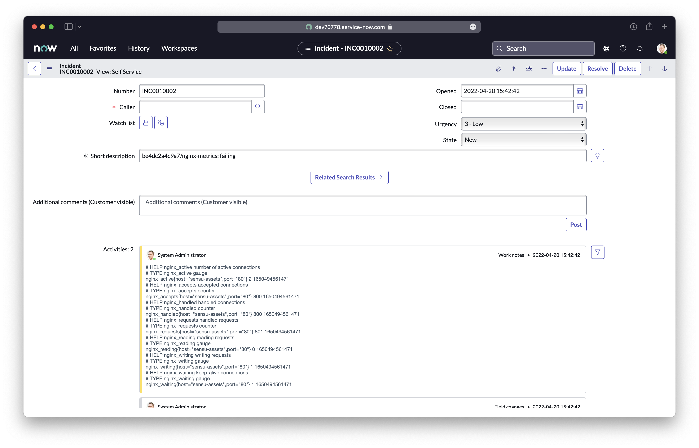

## Overview

<!-- Sensu Integration description; supports markdown -->

The ServiceNow Incident Management integration provides support for automatically creating, updating, and resolving ServiceNow incidents based on Sensu events.

This integration is compatible with ServiceNow versions **Rome and older**.

<!-- Provide a high level overview of the integration contents (e.g. checks, filters, mutators, handlers, assets, etc) -->

This integration includes the following Sensu resources:

* `servicenow-incidents` [handler]
* `discovery-only` [filter]
* `servicenow-incidents` [pipeline]
* `sensu/sensu-servicenow-handler:3.0.2` [asset]

## Dashboards

<!-- List of compatible dashboards w/ screenshots (supports png, jpeg, and gif images; relative paths only; e.g. `` )-->

The ServiceNow Incident Management integration is compatible with ServiceNow incident management dashboards.



## Setup

<!-- Sensu Integration setup instructions, including Sensu agent configuration and external component configuration -->
<!-- EXAMPLE: what configuration (if any) is required in a third-party service to enable monitoring? -->

1. Get the ServiceNow instance's base URL (e.g. https://mycompany.service-now.com), username, and password.

   **Optional**: If you want to use Sensu [secrets] to represent the ServiceNow username and password, you will need the secret names when you install this integration.

1. If your organization has a customized ServiceNow instance, get the following configuration information:

    - Name of the ServiceNow incident table to use for managing incidents
    - Field name that Sensu should use to look up CIs (the incident key)
    - [Handler templates][handler-templating] for the incident short description and work notes
    - Custom incident properties to populate from Sensu entity [annotations]

    **NOTE**: If you are using an unmodified ServiceNow instance, the installation steps for this integration include default configuration details. You do not need custom configuration to use this integration.

1. Enable ServiceNow incident management registration by specifying a check pipeline reference.
   
   <details><summary><strong>Example: Check pipeline reference configuration</strong></summary>

   To enable ServiceNow incident management registration only for entities that execute a specific check, add the `servicenow-incidents` [pipeline] to the check definition.

   ```yaml
   spec:
     pipelines:
       - api_version: core/v2
         type: Pipeline
         name: servicenow-incidents
   ```

   </details>
   <br>

1. **Optional** Specify custom ServiceNow incident configuration on a per-entity or per-check basis.

   <details><summary><strong>Example: Custom incident table and asset tag configuration</strong></summary>

   The ServiceNow Incident Management integration uses the configuration parameters you specify during installation. To override the installed configuration for a single entity or check, add [annotations] with the prefix `servicenow/config/` to the `agent.yml` configuration file or the check definition.

   ```yaml
   annotations:
     servicenow/config/incident-table: "incident"
     servicenow/config/incident-work-notes: "{{ .Check.Annotations.servicenow_work_notes }}"
   ```

   For a complete list of available annotations, read the [sensu/sensu-servicenow-handler annotations documentation].

   </details>
   <br>

1. **Optional** Configure custom ServiceNow incident properties.

   <details><summary><strong>Example: Custom ServiceNow incident property configuration</strong></summary>

   The ServiceNow Incident Management integration supports ServiceNow incident tables with custom fields.

   When you install this integration, you can list custom incident properties to populate from Sensu entity [annotations] with the prefix `servicenow/table/incident/`. If an entity includes a matching annotation, Sensu will populate the corresponding field in the ServiceNow incident table with the annotation's value.

   For example, if you list the `category` and `store_id` custom CI properties when you install this integration, Sensu will check entities for matching annotations.

   Set the entity annotations in the `agent.yml` configuration file:

   ```yaml
   annotations:
     servicenow/table/incident/category: "software"
     servicenow/table/incident/store_id: "1234"
   ```

   To add custom incident properties after installing this integration, update the `servicenow-incidents` handler command to list the additional properties in the `--incident-properties` flag values:

   ```yaml
   command: >-
    sensu-servicenow-handler --incident-management --incident-table incident --incident-key short_description --incident-description "{{ .Check.State }}" --incident-work-notes "{{ .Check.Output }}" --incident-properties "category,store_id,location"
   ```

   </details>
   <br>

2. **[OPTIONAL] Customize ServiceNow Incident properties**

   This integration supports custom ServiceNow Incident Management tables with custom fields.
   To enable custom fields set the `--incident-properties` flag (e.g. `--incident-properties category,store_id`).
   _NOTE: The integration installation wizard will prompt you for a list of custom fields._

   Once enabled, custom properties can be set on a per-host basis _or_ a per-check basis by using `servicenow/table/incident/<fieldname>` annotations.

   Example (assuming `--incident-properties: category,store_id`):

   ```yaml
   annotations:
     servicenow/table/incident/category: "software"
     servicenow/table/incident/store_id: "1234"
   ```

## Plugins

<!-- Links to any Sensu Integration dependencies (i.e. Sensu Plugins) -->

The ServiceNow Incident Management integration uses the following Sensu [plugins]:

- [sensu/sensu-servicenow-handler][sensu-servicenow-handler-bonsai]

## Alerts

<!-- List of all alerts generated by this integration. -->

<!-- This integration provides an alert & incident management processing pipeline for use with other monitoring integrations. By default this integration will process all events passing the [built-in `is_incident` filter][is_incident] (i.e. failing events and resolution events only). Event processing via this integration may be suppressed using [Sensu Silencing][silences] (see the [built-in `not_silenced` filter][not_silenced] for more details). -->

The ServiceNow Incident Management integration does not produce any events that should be processed by an alert or incident management [pipeline].

## Metrics

<!-- List of all metrics or events collected by this integration. -->

The ServiceNow Incident Management integration does not produce any [metrics].

## Reference Documentation

<!-- Please provide links to any relevant reference documentation to help users learn more and/or troubleshoot this integration; specifically including any third-party software documentation. -->

* [Handler templating][handler-templating] (Sensu documentation): the ServiceNow Incident Management integration supports handler templating for variable substitution with data from Sensu events
* [Incident Management][servicenow-incident-mgmt] (ServiceNow documentation)


<!-- Links -->
[check]: https://docs.sensu.io/sensu-go/latest/observability-pipeline/observe-schedule/checks/
[asset]: https://docs.sensu.io/sensu-go/latest/plugins/assets/
[subscription]: https://docs.sensu.io/sensu-go/latest/observability-pipeline/observe-schedule/subscriptions/
[subscriptions]: https://docs.sensu.io/sensu-go/latest/observability-pipeline/observe-schedule/subscriptions/
[agents]: https://docs.sensu.io/sensu-go/latest/observability-pipeline/observe-schedule/agent/
[annotation]: https://docs.sensu.io/sensu-go/latest/observability-pipeline/observe-schedule/agent/#general-configuration-flags
[plugins]: https://docs.sensu.io/sensu-go/latest/plugins/
[metrics]: https://docs.sensu.io/sensu-go/latest/observability-pipeline/observe-schedule/metrics/
[pipeline]: https://docs.sensu.io/sensu-go/latest/observability-pipeline/observe-process/pipelines/
[handler]: https://docs.sensu.io/sensu-go/latest/observability-pipeline/observe-process/handlers/
[filter]: https://docs.sensu.io/sensu-go/latest/observability-pipeline/observe-filter/filters/
[filters]: https://docs.sensu.io/sensu-go/latest/observability-pipeline/observe-filter/filters/
[secret]: https://docs.sensu.io/sensu-go/latest/operations/manage-secrets/secrets/
[secrets]: https://docs.sensu.io/sensu-go/latest/operations/manage-secrets/secrets/
[tokens]: https://docs.sensu.io/sensu-go/latest/observability-pipeline/observe-schedule/tokens/
[handler-templating]: https://docs.sensu.io/sensu-go/latest/observability-pipeline/observe-process/handler-templates/
[sensu-plus]: https://sensu.io/features/analytics
[sensu-servicenow-handler-bonsai]: https://bonsai.sensu.io/assets/sensu/sensu-servicenow-handler
[servicenow-incident-mgmt]: https://docs.servicenow.com/bundle/rome-it-service-management/page/product/incident-management/concept/c_IncidentManagement.html
[sensu/sensu-servicenow-handler annotations documentation]: https://bonsai.sensu.io/assets/sensu/sensu-servicenow-handler#annotations
