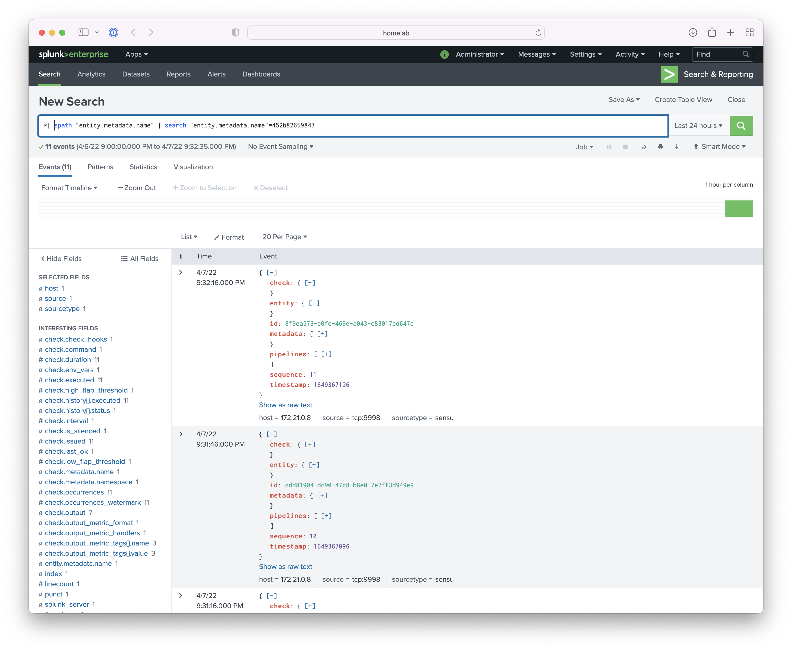

## Overview

<!-- Sensu Integration description; supports markdown -->

The Splunk Events integration provides a Sensu pipeline for sending events to Splunk as log data using a [Splunk TCP input][Get data from TCP and UDP ports].

<!-- Provide a high level overview of the integration contents (e.g. checks, filters, mutators, handlers, assets, etc) -->

This integration includes the following Sensu resources:

* `splunk-events` [TCP stream handler]
* `events-only` [mutator]
* `splunk-events` [pipeline]

## Dashboards

<!-- List of supported dashboards w/ screenshots (supports png, jpeg, and gif images; relative paths only; e.g. `` )-->

The Splunk Events integration makes Sensu event data available for searching and graphing in Splunk:



## Setup

<!-- Sensu Integration setup instructions, including Sensu agent configuration and external component configuration -->
<!-- EXAMPLE: what configuration (if any) is required in a third-party service to enable monitoring? -->

1. Get the Splunk endpoint host and port number. You will need this information to install the integration.

   **NOTE**: If Splunk Universal Forwarders are installed directly on Sensu backend nodes (or Kubernetes pods), use `localhost` or `127.0.0.1` as the host name.

1. Configure Splunk or a Splunk Universal Forwarder [network input][splunk-network-input] for Sensu events.

   <details><summary><strong>Example: inputs.conf file configuration</strong></summary>

   Accept connections from any host on port `9998`:

   ```
   [tcp://9998]
   disabled = 0
   queue = parsingQueue
   sourcetype = sensu
   ```

   Accept connections from a specific host (e.g. `sensu-backend`) on port `9998`:

   ```
   [tcp://sensu-backend:9998]
   disabled: 0
   queue = parsingQueue
   sourcetype: sensu
   ```

   Read the Splunk [`inputs.conf` documentation][splunk-inputs-conf] for more information.

   </details>
   <br>

   <details><summary><strong>Example: props.conf file configuration</strong></summary>

   ```
   [default]
   TRUNCATE = 50000

   [sensu]
   TRUNCATE = 50000
   ```

   Read the Splunk [`props.conf` documentation][splunk-props-conf] for more information.

   </details>
   <br>

1. Add the `splunk-events` [pipeline] to one or more [checks].

   <details><summary><strong>Example: Check pipeline configuration</strong></summary>

   ```yaml
   spec:
     pipelines:
       - api_version: core/v2
         type: Pipeline
         name: splunk-events
   ```

   </details>
   <br>

1. **Optional** Configure the Splunk Universal Forwarder to forward Sensu event data to the Splunk [indexer].

   <details><summary><strong>Example: outputs.conf file configuration</strong></summary>

   ```
   [tcpout]
   defaultGroup=sensu_events
   maxQueueSize=104857600

   [tcpout:sensu_events]
   server=splunk:9997
   maxQueueSize=104857600

   [tcpout-server://splunk:9997]
   ```

   Read the Splunk [`outputs.conf` documentation][splunk-outputs-conf] for more information.

   </details>
   <br>

## Plugins

<!-- Links to any Sensu Integration dependencies (i.e. Sensu Plugins) -->

The Splunk Events integration uses [Sensu's built-in TCP handler][sensu-tcp-handler] to process Sensu events. The integration does not use any Sensu [plugins].

## Alerts

The Splunk Events integration does not produce any events that should be processed by an alert or incident management [pipeline].

## Metrics

The Splunk Events integration does not produce any [metrics].

## Reference Documentation

<!-- Please provide links to any relevant reference documentation to help users learn more and/or troubleshoot this integration; specifically including any third-party software documentation. -->

* [Handler templating][handler-templating] (Sensu documentation): the Splunk Events integration supports handler templating for variable substitution with data from Sensu events
* [Configuration file directories] (Splunk documentation)
* [Get data from TCP and UDP ports][splunk-network-input] (Splunk documentation)
* [TCP: Transport Control Protocol (TCP) network inputs][splunk-tcp-input] (Splunk documentation)


<!-- Links -->
[check]: https://docs.sensu.io/sensu-go/latest/observability-pipeline/observe-schedule/checks/
[asset]: https://docs.sensu.io/sensu-go/latest/plugins/assets/
[subscription]: https://docs.sensu.io/sensu-go/latest/observability-pipeline/observe-schedule/subscriptions/
[subscriptions]: https://docs.sensu.io/sensu-go/latest/observability-pipeline/observe-schedule/subscriptions/
[agents]: https://docs.sensu.io/sensu-go/latest/observability-pipeline/observe-schedule/agent/
[annotation]: https://docs.sensu.io/sensu-go/latest/observability-pipeline/observe-schedule/agent/#general-configuration-flags
[plugins]: https://docs.sensu.io/sensu-go/latest/plugins/
[metrics]: https://docs.sensu.io/sensu-go/latest/observability-pipeline/observe-schedule/metrics/
[pipeline]: https://docs.sensu.io/sensu-go/latest/observability-pipeline/observe-process/pipelines/
[handler]: https://docs.sensu.io/sensu-go/latest/observability-pipeline/observe-process/handlers/
[secret]: https://docs.sensu.io/sensu-go/latest/operations/manage-secrets/secrets/
[secrets]: https://docs.sensu.io/sensu-go/latest/operations/manage-secrets/secrets/
[tokens]: https://docs.sensu.io/sensu-go/latest/observability-pipeline/observe-schedule/tokens/
[handler-templating]: https://docs.sensu.io/sensu-go/latest/observability-pipeline/observe-process/handler-templates/
[sensu-plus]: https://sensu.io/features/analytics
[splunk-network-input]: https://docs.splunk.com/Documentation/Splunk/latest/Data/Monitornetworkports
[splunk-tcp-input]: https://docs.splunk.com/Documentation/Splunk/latest/Admin/Inputsconf#TCP:_Transport_Control_Protocol_.28TCP.29_network_inputs
[Configuration file directories]: https://docs.splunk.com/Documentation/Splunk/latest/Admin/Configurationfiledirectories
[splunk-props-conf]: https://docs.splunk.com/Documentation/Splunk/latest/Admin/Propsconf
[splunk-outputs-conf]: https://docs.splunk.com/Documentation/Splunk/latest/Admin/Outputsconf
[sensu-tcp-handler]: https://docs.sensu.io/sensu-go/latest/observability-pipeline/observe-process/handlers/#tcpudp-handlers
[splunk-inputs-conf]: https://docs.splunk.com/Documentation/Splunk/latest/Admin/Inputsconf
[TCP stream handler]: https://docs.sensu.io/sensu-go/latest/observability-pipeline/observe-process/tcp-stream-handlers/
[indexer]: https://docs.splunk.com/Documentation/Splunk/latest/Indexer/Aboutindexesandindexers
[mutator]: https://docs.sensu.io/sensu-go/latest/observability-pipeline/observe-transform/mutators/
